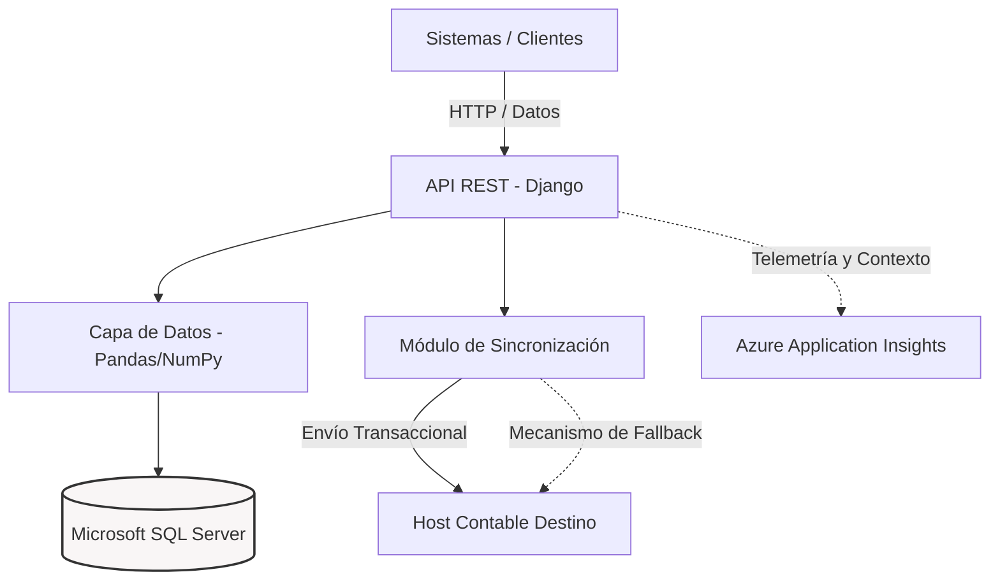

# API de Sincronización Contable

Este proyecto implementa una solución robusta para la integración y sincronización de datos de compras hacia sistemas contables. En lugar de funcionar como una simple pasarela de datos, el sistema actúa como un intermediario transaccional que garantiza la integridad, resiliencia y el seguimiento de las operaciones financieras.

## Propuesta de Valor y Solución

El núcleo del sistema es un mecanismo de sincronización diseñado para operar en entornos donde la disponibilidad del host destino puede variar. Las decisiones de arquitectura están enfocadas en la confiabilidad:

* **Trazabilidad Absoluta:** Asegura el seguimiento local de cada asiento contable mediante una estricta máquina de estados (`Pendiente`, `Enviado`, `Error`). Esto garantiza auditorías precisas sobre qué información ha sido procesada.
* **Resiliencia y Fallback Automático:** En escenarios de inestabilidad de red o si el host contable cambia de puerto dinámicamente, el sistema cuenta con un mecanismo de *fallback* diseñado para interceptar el fallo, reconfigurar el destino y reintentar la conexión, evitando la pérdida o duplicación de datos financieros.
* **Procesamiento Eficiente:** Transformación y consolidación de comprobantes y archivos XML (`lxml`) utilizando `pandas` y `numpy` para optimizar el rendimiento de la carga en memoria antes de la persistencia transaccional.

## Arquitectura del Sistema

Arquitectura de la aplicación detallando la ingesta, procesamiento, almacenamiento y telemetría.



## Stack Tecnológico

El proyecto está construido sobre un stack enfocado en procesamiento de datos y despliegue empresarial:

* **Core Web/API:** Python 3, Django 6.x, Django REST Framework.
* **Procesamiento y ETL:** Pandas, NumPy, lxml.
* **Persistencia:** Microsoft SQL Server (integración vía `mssql-django` y `pyodbc`).
* **Observabilidad:** Telemetría distribuida con Azure (`opencensus`, `opencensus-ext-azure`).
* **Infraestructura:** Gunicorn con `gthread` workers, servido de estáticos optimizado con Whitenoise.

## Configuración y Despliegue

La aplicación está diseñada para despliegues inmutables en plataformas PaaS (como Azure App Service) y utiliza un archivo `Procfile` para definir la inicialización del contenedor.

### Desarrollo Local

1. Crear y activar el entorno virtual:
   ```bash
   python -m venv venv
   source venv/bin/activate  # En Windows: venv\Scripts\activate
   ```
2. Instalar las dependencias exactas:
   ```bash
   pip install -r requirements.txt
   ```
3. Configurar variables de entorno basándose en `.env.example` (incluyendo cadenas de conexión a MS SQL y claves de telemetría de Azure).

### Ejecución en Producción

El ciclo de arranque definido para el servidor de producción garantiza que las migraciones se apliquen antes de levantar la aplicación WSGI:

```bash
python manage.py migrate --noinput
python manage.py collectstatic --noinput
gunicorn config.wsgi --workers 2 --threads 2 --worker-class gthread --bind 0.0.0.0:8000 --timeout 60
```
