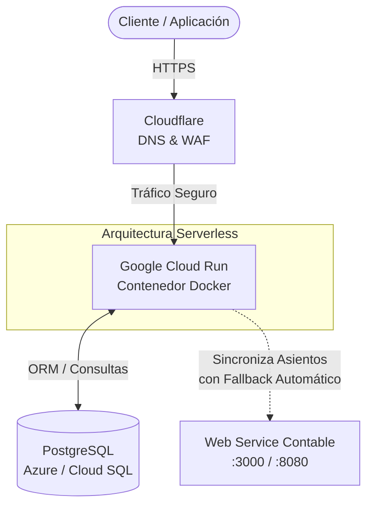

# API de Sincronización Contable

API REST desarrollada en Django orientada a la sincronización robusta y segura de datos financieros entre sistemas.

Este proyecto va más allá de un simple CRUD. Diseñé un **mecanismo de sincronización** que asegura la trazabilidad local de los asientos contables mediante un sistema de estados (`Pendiente`, `Enviado`, `Error`). Esto garantiza la integridad de los datos, previene la pérdida de transacciones y permite un *fallback* automático y reintentos seguros si el host remoto experimenta caídas o cambios de puerto.

## Arquitectura e Infraestructura

El sistema está diseñado pensando en escalabilidad y alta disponibilidad. A continuación se detalla el flujo de datos y la infraestructura:



- **Despliegue y Orquestación:** Contenedorizado con **Docker** y preparado para operar sin servidor (Serverless) en **Google Cloud Run**.
- **Base de Datos:** Integración robusta con **PostgreSQL** (preparado para entornos gestionados como Azure Database o Cloud SQL).
- **Red y Seguridad:** Arquitectura pensada para operar detrás de **Cloudflare** para la gestión ágil de DNS, terminación SSL estricta y mitigación de ataques DDoS.

---

## Integración con el Web Service Contable

El sistema despacha automáticamente los asientos hacia el WS contable cuando una orden de trabajo o compra pasa a estado `Completada`.

**Resiliencia y Trazabilidad Local:**
Para evitar discrepancias en auditorías, cada asiento guarda localmente:
- Estado de envío (`Pendiente`, `Enviado`, `Error`).
- ID remoto asignado por el sistema contable.
- Fecha exacta de sincronización.
- Logs o mensajes de error (permite detectar y corregir errores de mapeo sin perder el asiento local).

Si el host cambia de puerto y no se define uno explícito (`WS_CONTABLE_BASE_URL`), la integración intenta un *fallback* automático a los puertos habituales (`:3000` y `:8080`).

---

## Entorno de Desarrollo Local

### 1. Requisitos y Setup Inicial

```bash
# Clonar el repositorio
git clone https://github.com/JustSidus/python-accounting-integration.git
cd python-accounting-integration

# Crear y activar el entorno virtual
python -m venv venv

# En Windows:
venv\Scripts\activate
# En Mac/Linux:
source venv/bin/activate

# Instalar dependencias
python -m pip install -r requirements.txt
```

### 2. Configuración y Ejecución

```bash
# Copiar variables de entorno (Windows: Copy-Item .env.example .env)
cp .env.example .env

# Aplicar migraciones a la base de datos
python manage.py migrate

# Crear usuario administrador
python manage.py createsuperuser

# Levantar el servidor local
python manage.py runserver
```

> **Nota de red:** Por defecto, este proyecto utiliza el puerto `8010` (`127.0.0.1:8010`) para evitar conflictos con otras aplicaciones locales. Se puede modificar ajustando `DJANGO_RUNSERVER_ADDRPORT` en el archivo `.env`.

### Endpoints Principales

- **Sistema principal:** `http://127.0.0.1:8010/`
- **Dashboard Admin:** `http://127.0.0.1:8010/admin/`
- **API REST (Asientos):** `http://127.0.0.1:8010/api/asientos/`
- **Autenticación API:** `http://127.0.0.1:8010/api-auth/login/`
